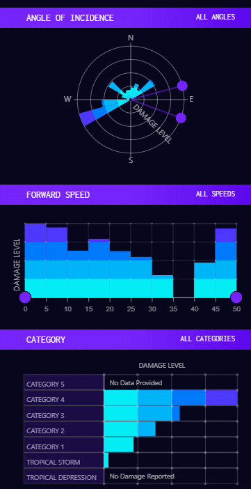
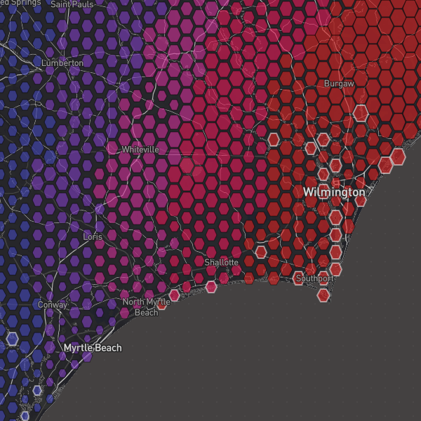
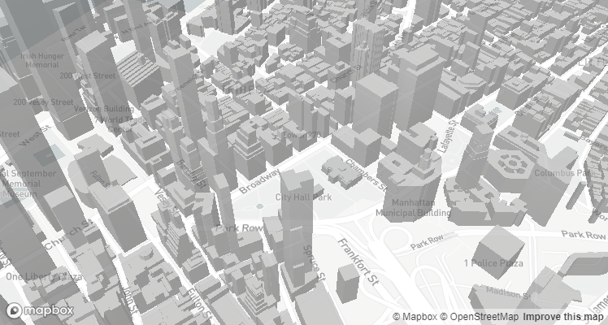
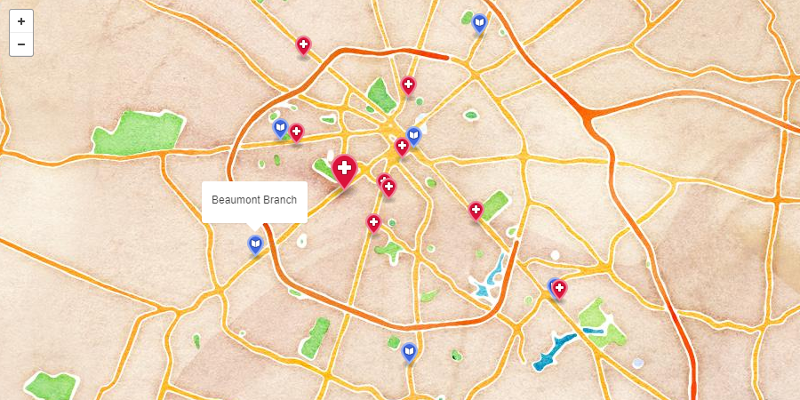

# Visualization Technologies

## D3.js

[D3.js](https://d3js.org/) is a JavaScript library for manipulating documents based on data. [[source](https://d3js.org/)]

### Advantages

D3 allows the user to dynamically create and update content in a web browser by looping through a data set (or multiple) and applying data-driven styles and transformations to either DOM elements or an [HTML5 canvas](#canvas).

### Disadvantages

While D3 is optimized and useful for interacting with DOM elements, only the portions that deal with data manipulation may be used when dealing with HTML5 canvas, requiring custom solutions or third-party libraries.

### Ideal Use Cases

D3 has two optimal use cases.

In the first scenario, D3 is used to both manipulate data and display it in the DOM via SVG. This is most useful for interactive graphs or data manipulation controls and filters.

D3 also shines when you're just using its data manipulation methods. The second use case uses D3 to filter data and map it to sizes/colors/other data/etc. and then we use these values to display data via HTML5 canvas.

## Canvas

Added in [HTML5](https://developer.mozilla.org/en-US/docs/HTML/HTML5), the HTML `<canvas>` element can be used to draw graphics via scripting in JavaScript. For example, it can be used to draw graphs, make photo compositions, create animations, or even do real-time video processing or rendering. [[source](https://developer.mozilla.org/en-US/docs/Web/API/Canvas_API)]

### Advantages

Canvas is preferred over SVG when performance and flexibility are desired. SVGs live in the DOM, which adds memory and rendering overhead, whereas canvas graphics exist for as long as it takes to draw the image onto the canvas. Canvas graphics may also be animated and otherwise processed in ways that SVGs cannot.

Canvas also provides us the ability to post-process raster images and videos on the fly. This allows us to perform interesting techniques on data that has either been pre-rendered or rendered offscreen.

### Disadvantages

User interaction with the HTML5 canvas is more difficult than interaction with DOM-based approaches like SVG. Since there are no elements to attach listeners to, you must track the mouse position and perform calculations to see if it is within the area you want to be clickable.

### Ideal Use Cases

## Three.js

[Three.js](https://threejs.org/) is a 2D and 3D graphics library written for WebGL and canvas.

### Advantages

Three.js allows us to easily render visualizations in 3D.

### Disadvantages

The overhead of rendering a full-3D scene in a web browser is too much for some client machines to handle, and limits us to only machines with adequate hardware.

### Ideal Use Cases

Showcasing data in a stylized and three-dimensional manner.

[[source](http://armsglobe.chromeexperiments.com/)]

## Our Recommendation

For most cases, using D3 in conjunction with SVG or HTML5 canvas will a powerful combination. Using SVG has the downside of being the least performant option, but for almost every simple graph to moderately detailed visualization it will be worth using for the simplicity it brings in terms of user interaction. In cases where the visualization is very detailed or requires otherwise calculation-heavy elements, using HTML5 canvas should bring the performance back up.

For many other cases, it will be worth potentially limiting the userbase in order to take advantage of the possibilities that a full-3D scene brings to the table. For instance, a 3D model of a city will be more easily traversed and understood by the user than a 2D map when dealing with data related to elevation.

# Mapping Technologies

## Leaflet.js

[Leaflet.js](http://leafletjs.com/) is a mapping library that allows us to display map tiles and data together easily.

### Advantages

Leaflet is very simple and extensible. Using it in a project requires minimal setup and execution.

Leaflet can render data in both SVG and HTML5 canvas, and provides an API for using the same code to generate either.

### Disadvantages

Leaflet by itself just provides the framework to display map tiles, data, and other things. If you want a basemap you must use tiles from a third-party source such as [Mapbox](#mapbox).

### Ideal Use Cases

Leaflet has two primary functions for us:

1. Displaying basemap tiles
1. Displaying polygonal data on the map (in most cases)

We then use [D3.js](#d3js), [Turf.js](#turfjs), and/or [Three.js](#threejs) to augment and extend the existing data.

## Mapbox

[Mapbox](https://www.mapbox.com/) is a JavaScript library built on [Leaflet.js](#leafletjs). It provides additional functionality for data-driving the styles of data displayed on the map, as well a suite of tools dedicated to creating and editing map tile styles.

### Advantages

Mapbox has two implementations, a raster-based system, and a WebGL based vector system.

MapboxGL provides 3D rendering capabilities as well as a performance boost and seamless transitions between zoom level (no need to lead new raster tiles when you're just loading one set of vector tiles).

Mapbox's map style creation tool is fantastic for both prototyping in and implementing final designs.

### Disadvantages

Mapbox only really has one major disadvantage if you're choosing between it and Leaflet.js. This is that you cannot plug D3.js' data manipulation methods easily into Mapbox's proprietary data-driven styling methods.

Also, a recent version of Internet Explorer 11 introduced a bug when adding data sources to a Mapbox map, causing a blank screen. This is obviously not an issue when IE11 is not required for the project.

### Ideal Use Cases

Mapbox can be used interchangeably with Leaflet.js for projects that do not require IE11 support.

In cases where three-dimensional representation may help the visual cognition of data, Mapbox is incredibly easy to use.

Mapbox's data-driven styling methods also simplify data visualization, if the project scope fits within the limitations of said methods.

## Turf.js

[Turf.js](http://turfjs.org/) is an extremely powerful geospatial vector analysis library.

### Advantages

Turf.js reduces complex geographical operations down to a simple method call.

### Disadvantages

Turf.js must be used client-side if you are not using Node.js as your backend. This means that complex calculations may potentially be offloaded to the client machine.

### Ideal Use Cases

Turf.js is ideal for optimizing user-interaction with data - i.e. detecting if geographical points are within a selection, creating grids or random areas of arbitrary data, scaling, rotating, or otherwise transforming data, etc.

Here, Turf.js is used to find the nearest hospital to a branch of a public library selected by the user. [[source](https://bl.ocks.org/pdbartsch/44332447869f2a450144)]

## Our Recommendation

A combination of Leaflet.js, Turf.js, and D3 will be more than adequate for most visualization projects.

When not using IE11, or if the project has 3D requirements, then swapping Leaflet.js for Mapbox is the optimal pairing. Three.js can also be overlaid on top of the map if IE11 is required, and 3D is not optional.

`TODO: Compare against ESRI web app - might need Kam's help`

# User Interface Framework Technology

## Angular.js v1.x

`TODO`

Description here

### Advantages

Angular is a large framework, and as such has many built-in pieces of functionality that can be applied to many use-cases and design practices.

Angular's "opinionated" nature can be advantageous once you learn the design practices, because it can allow you to code large projects with much less overhead. [[opinionation](https://stackoverflow.com/a/802064/2651657)]

### Disadvantages

Angular 1.x is nearing its end-of-life. It also has a rather large footprint, and is slower than its competitors.

Angular's "opinionated" nature can be limiting if you are trying to do something in a way that the developers did not account for. [[opinionation](https://stackoverflow.com/a/802064/2651657)]

### Ideal Use Cases

`TODO`

## Angular v2+

`TODO`

Description here

### Advantages

`TODO`

- TypeScript recommended
- Many built-in tools for generic parts of web apps

### Disadvantages

`TODO`

- "Opinionated", not as flexible as React

### Ideal Use Cases

`TODO`

## React.js

`TODO`

`I really don't know enough about React to write a full comparison, and I'm worried that since they actively use React I won't be able to provide an adequate point-for-point comparison.`

Description here

### Advantages

`TODO`

- Fast
	- Virtual DOM
- Extreme extensibility
- Not opinionated

### Disadvantages

`TODO`

- Not "opinionated"

### Ideal Use Cases

`TODO`

## Vue.js

`TODO`

[Vue.js](https://vuejs.org/) is a progressive framework for building user interfaces. Unlike other monolithic frameworks, Vue is designed from the ground up to be incrementally adoptable. The core library is focused on the view layer only, and is very easy to pick up and integrate with other libraries or existing projects. On the other hand, Vue is also perfectly capable of powering sophisticated Single-Page Applications when used in combination with [modern tooling](https://vuejs.org/v2/guide/single-file-components.html) (`.vue` files, detailed [below](#advantages-9)) and [supporting libraries](https://github.com/vuejs/awesome-vue#components--libraries). [[source](https://vuejs.org/v2/guide/)]

[Vue Benchmark](https://vuejs.org/v2/guide/comparison.html)

### Advantages

Of the three frameworks we're reviewing, Vue.js has the smallest footprint and the fastest benchmarks. Leveraging the power of the virtual DOM (like React, but Vue's is lighter weight), it avoids any repaints of the UI until necessary. Vue's architecture also allows for more performant JS operations to achieve the same results.

Vue's "opinionated" nature can be advantageous once you learn the design practices, because it can allow you to code large projects with much less overhead. [[opinionation](https://stackoverflow.com/a/802064/2651657)]

Vue allows you to write all of your code (HTML, JS, and CSS) inside one file - a `.vue` file. This allows segregation of code and simplification of organization. Vue accomplishes this with [Webpack](https://webpack.js.org/). Each `.vue` file consists of a `<template>`, `<script>`, and `<style>` tag, which you write your HTML, JS, and CSS in respectively. Each tag also takes a `lang` attribute, where you can specify a pre or post processor for the language you are writing. For instance, you can put `lang="scss"` on your `<style>` tag, write in SCSS, and Webpack will auto-compile to CSS.

In a best of both worlds kind of way, Vue is developed similarly to Angular, but performs similarly to React.

### Disadvantages

Being a relatively new framework, community support for Vue is much less existent than Angular or React.

Vue's "opinionated" nature can be limiting if you are trying to do something in a way that the developers did not account for. [[opinionation](https://stackoverflow.com/a/802064/2651657)]

### Ideal Use Cases

Vue is ideally used for anything where you need high performance, and don't mind the restriction of its opinionation.

## Our Recommendation

`TODO`

- Vue?
